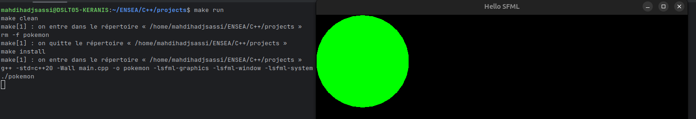
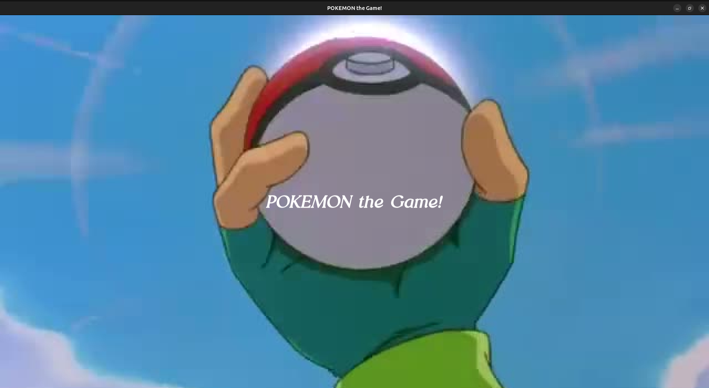
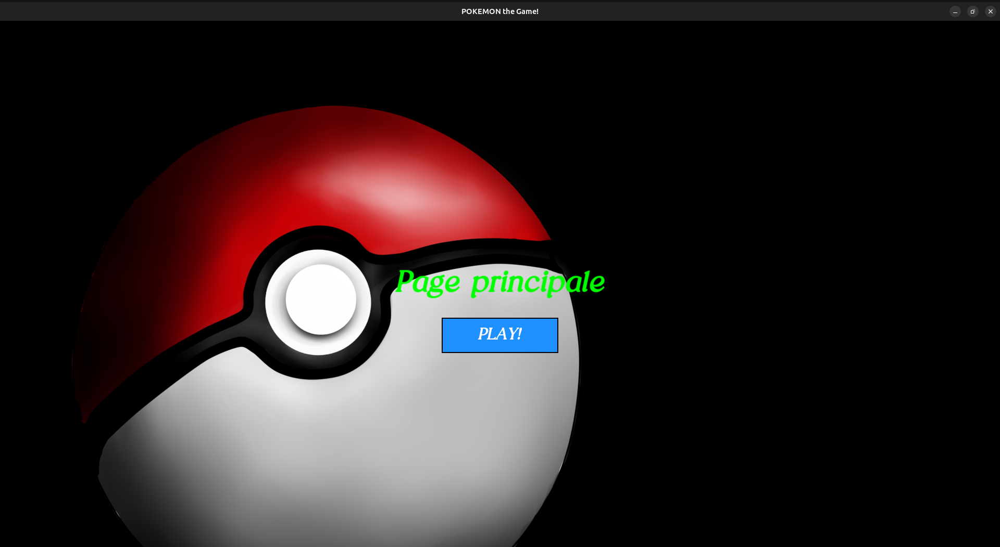
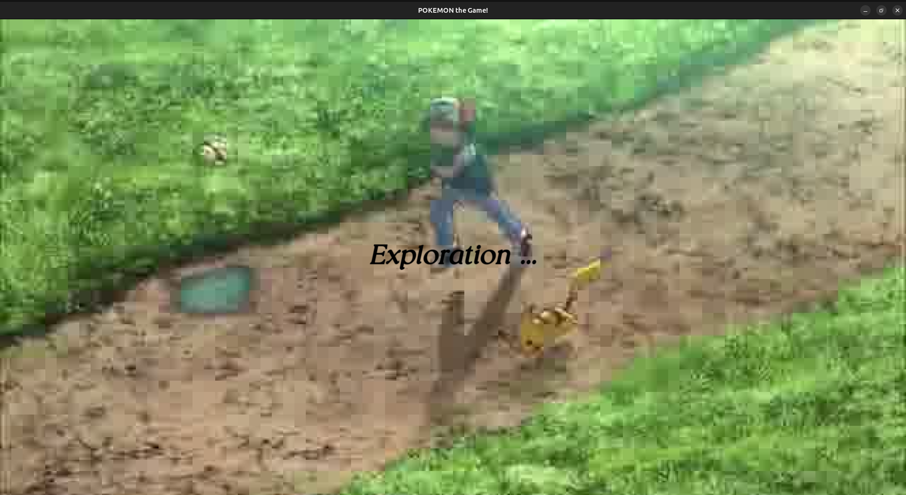
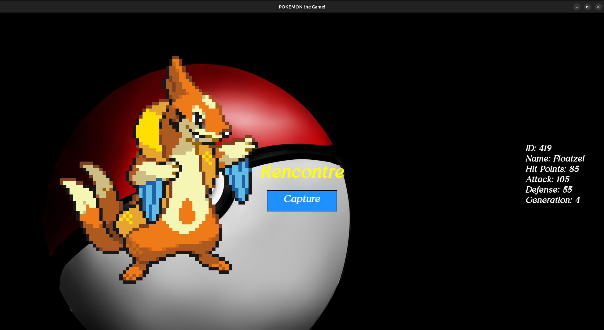
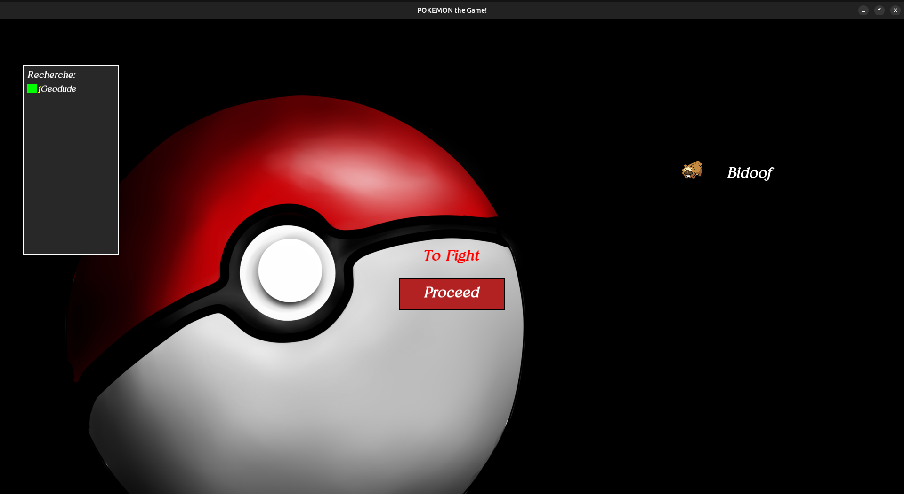
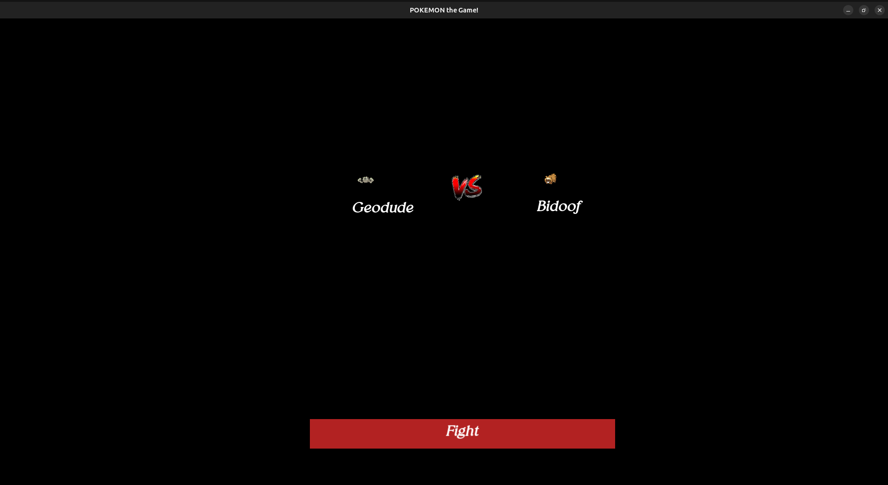

# Introduction C++
## 3éme année IS (par HADJ SASSI Mahdi)
### 2025-2026 (Semestre 1) (Encadré par M. TAUVEL)

# TP 1: Pokemon Selector

## 1.1 Mise en place du Framework SFML

Pour faire marcher SFML, il faut d'abord l'installer. Vous pouvez télécharger la bibliothèque en utilisant
la commande `sudo apt-get install libsfml-dev` sur les systèmes basés sur Debian/Ubuntu.

Lorsque qu'on a voulu le faire marché, on a eu des problémes de ce genre !
```
c++ /home/mahdihadjsassi/ENSEA/C++/projects/main.cpp -o main /usr/bin/ld: /tmp/ccV9YVlD.o: 
warning: relocation against _ZTVN2sf11CircleShapeE' in read-only section .text._ZN2sf11CircleShapeD2Ev[_ZN2sf11CircleShapeD5Ev]'
......
ld returned 1 exit status
```

Et merci au LLM, la solution c'est de faire lancer ces commandes de cmake pour le build : 

```bash
cmake -S . -B build
cmake --build build
./build/pokemon
```

Donc, pour faciliter la tache, on a fait un petit makefile pour lancer rapidement les commandes cmake. 

et voici le résultat pour l'exécution du programme :



## 1.2 Premiéres classes

On a inclus les fichiers de pokemon.hpp et .cpp de cours, dans le projet, et on a testé l'intégratlié de projet.

on a commité sur ce niveau, pour tester l'integration, dans les prochians commits, on va effacer les deux lignes 
pour afficher le pokemon.

le commit est le suivant : 
```commit 476e8cad77c803c2cccc39a37dc884c5e11e9beb```

le resultat de l'execution est le suivant :
```
./pokemon
ID: 1
Name: monster1
Hit Points: 100
Attack: 20
Defense: 10
Generation: 1
make[1]: on quitte le répertoire «/home/mahdihadjsassi/ENSEA/C++/projects»
```

### Pokemon class

Juste on a rajouté l'attribut `maxLife` avec sont getter, par rapport ce qui est fait dans le cours.

### PokemonVector class

J'ai rendu la classe protégé, avec le getter de vector est en constante, du coup on ne peut pas modifier son contenu.

### Pokedex class
Class en singleton, pour accéder à la base de donnée des pokemons. 
Il manque le mutex pour, faire the thread safe.

### PokemonParty class

Ici, il y'a un grand probléme de bonne pratique, il y'a deux méthodes exactes dans PokemonParty et Pokedex.
Il faut penser à une facon de factoriser le code, ou de trouver une différence entre les deux programmes.

### PokemonAttack class

Ici, on utilisé les paramétre par défaut dans la creatoin de packet pour jouer, on peut modifier le nombre de pokemon à integrer
et le random seed pour être aleatoire.

## 1.3 Une interface graphique
 
Merci au modéles LLM, qui m'a aidé à faire les interfaces graphiques!

J'ai suivi le design pattern STATE.

- Premiére page : Welcome page qui redirige vers Deuxiéme page

- Deuxiéme page : HomePage qui redirige vers Troisiéme page

- Troisiéme page : RandomPage qui redirige aléatoirement vers la Quatriéme page ou la Cinquiéme page
  - Si le PockemonParty est vide, automatiquement on redirige vers la Quatriéme page

- Quatriéme page : RencontrePage Pour capturer un pokemon aléatoire et l'ajouter à la PokemonParty
  - Le capture est aussi aléatoire, avec 50% de chance de capturer le pokemon.

- Cinquiéme page : Fighting Page, qui affiche des pokemon a attaquer, le nombre de pokemon est exactement le nombre dans la 
  Pokemon Party majoré à 6.
  - La page affiche aussi un espace de selection de pokemons pour faire le fight, max on peut séléctionner 6 pokemons ordonnée.
  - Un bouton pour faire le fight
    - si aucun pokemon n'est séléctionné, on redirige vers la Deuxiéme page
    - sinon on redirige vers la Sixiéme page 

- Sixiéme page : On affiche chaque pokemon avec son adversaire, et un bouton pour voir la resultat de la guerre.
  - on mise à jour la pokemon party avec les pokemon gangé et perdu

### 1.3.1 Lecteur Vidéo
Puisque SFML ne gère pas les vidéos, on a crée une classe videoPlayer qui utilise un chemin vers un dossier qui contient des 
frames, et les affiches en FPS, pour simuler un lecteur video.

- on a mis un vidéo dans l'intro (premiére page)
- on a mis un vidéo d'exploration (troisiéme page)
- Il me reste à faire un vidéo si j'ai perdu tous mes pokemons.


### 1.3.2 Orienté Composant
On a essayé le max possible de suivre les bonne pratiques, j'ai extrait des composants réutilisables, comme :
- POP UP
- Select Box
- VideoPlayer
- Button mais dans le fichier de racine common/CenteredActionPage

### 1.3.3 Magic Numbers
On a essayé de limiter le max possible les magic numbers et chaines de caractéres, en les mettant dans des constantes.
Dans le fichier config.hpp

### 1.3.4 Lecteur SON
Juste pour tester, on a mis un lecteur en boucle de le soundtrack theme de pokemon.
Mais pour objectives ultérieurs, on doit réserver un son pour l'intro, et pour chaque autre page, séparement.
Plus les effets des actions, doivenet avoir des sons séparés.

### 1.3.5 Test Unitaire
J'ai commencé de faires quelques tests unitaires surtout sur les entités. 
Malheureusement, je n'ai pas pu faire les tests unitaires sur les pages, car SFML n'est pas mockable.
Donc j'ai fait les tests unitaires manuellements.